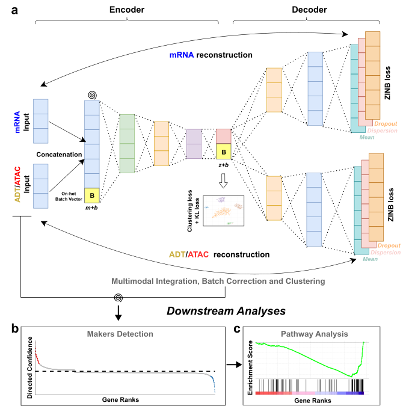
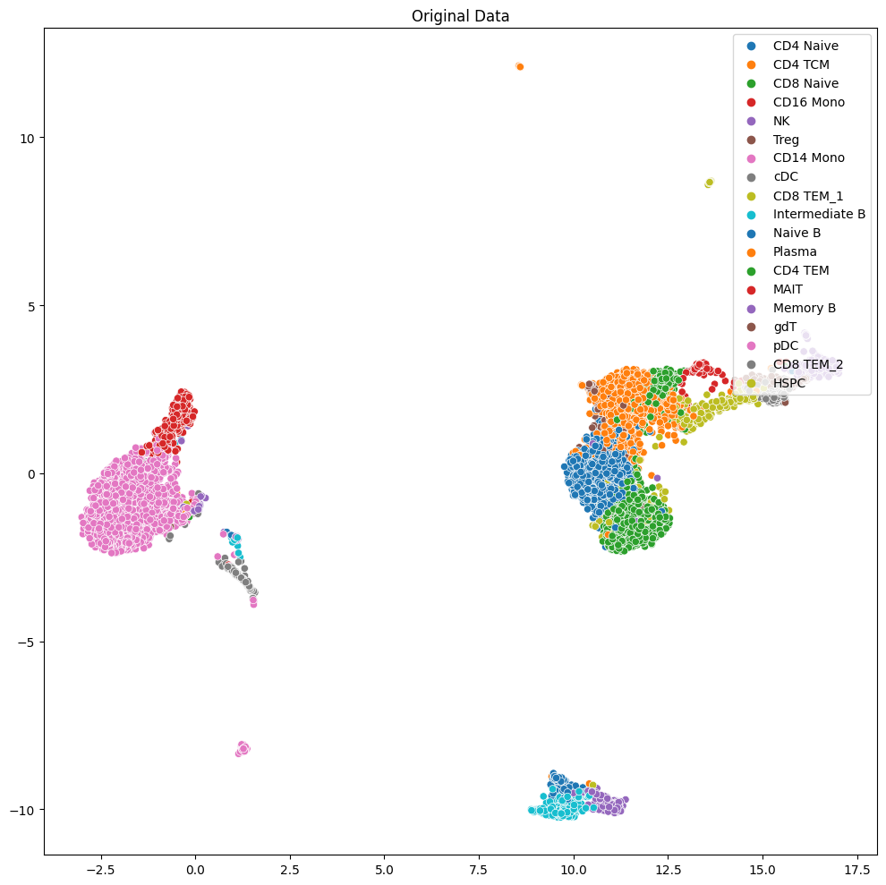
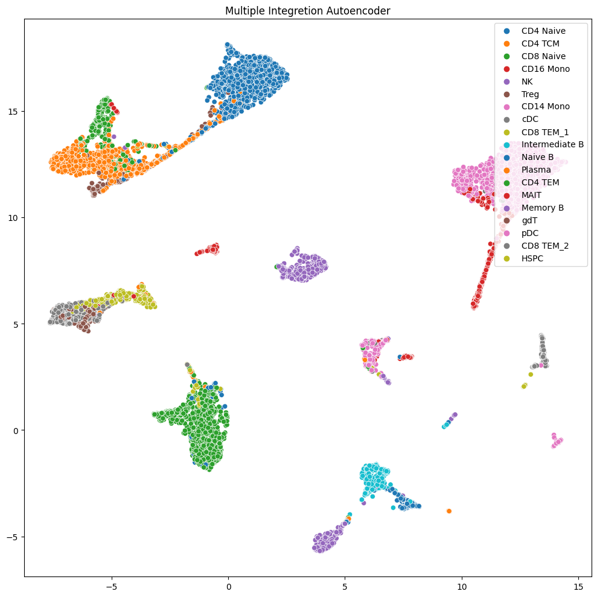
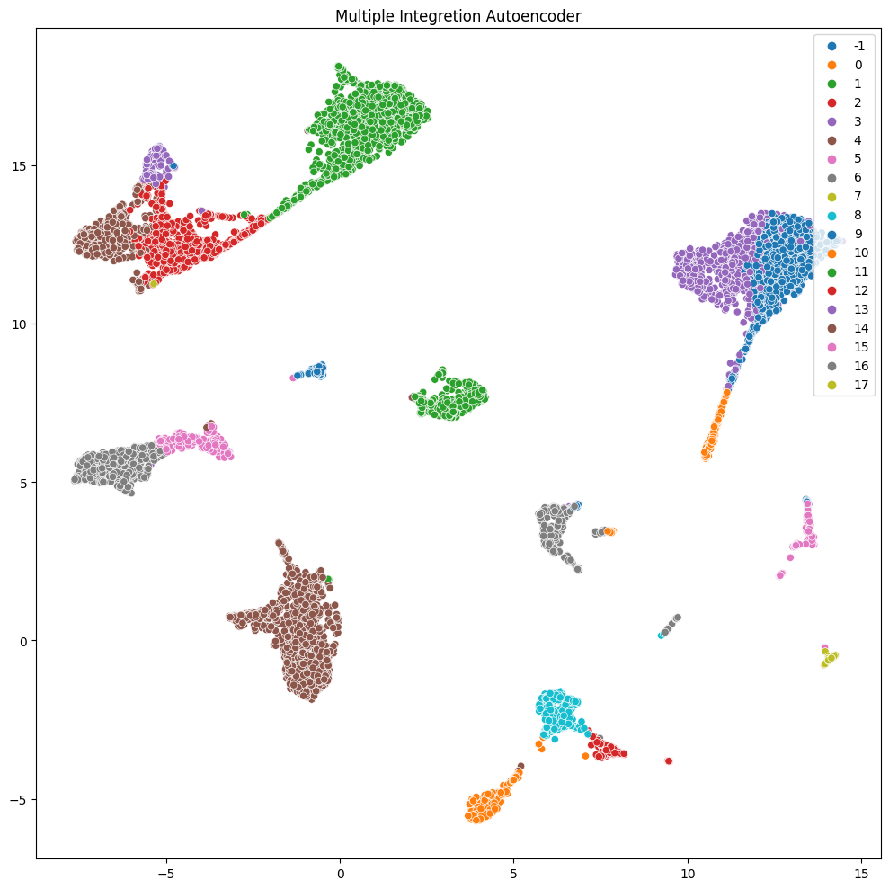

# 生信大作业

胡张艺 2021300004059


# Requiment

对于给定的预处理好的来自同一个细胞的SCRNA-seq和SCATAC-seq数据集(SCRNA_seq_for_final.tsv, scATAC_seq_for_final.tsv, label_for_ final.tsv)，即每个细胞的两个模态的特征，设计基于这两个模态，对细胞进行聚类的算法，并将聚类结果在UMAP空间可视化，以及计算与真实标签label_for_final.tsv 的聚类评价指标Adjusted rand index.要求写出算法，并提供代码和结果，不限制编程工具。

（注：关于评分：ARl大小不是衡量评分的唯一指标，主要指标是算法的合理性）

解决方案核心代码： 

* [run_scMDC.py](../src/run_scMDC.py)  
* [scMDC.py](../src/scMDC.py) 


# Input

`数据集存放目录：datasets`

* [label_for_final.tsv](../datasets/label_for_final.tsv)   		# 细胞类别标签 

* [scATAC_seq_for_final.tsv](../datasets/scATAC_seq_for_final.tsv)      # ATAC序列count数据（已处理）

* [scRNA_seq_for_final.tsv](../datasets/scRNA_seq_for_final.tsv)        # RNA序列count数据（已处理）


# Algorithm

* 基于改良VAE模型的多模态细胞信息深度聚类算法  

  


本文所述是一种用于**聚类**单细胞**多组学数据**的多**模态深度学习方法**。

* **输入**：两种模态的数据进行直接concatenation作为原始输入特征
* **模型架构**：采用多模态自编码器，具有一个编码器用于不同模态的串联数据和每个模态的独立解码器。
* **特征编码**：使用多层感知机神经网络进行特征提取，预测出最终特征的高斯分布平均值和方差，然后重参数化组成最终编码特征。
* **特征解码**：利用编码出的信息输入两个模态的多层感知机进行解码，重构原始数据。
* **训练过程**：并且针对单细胞组学生物信息特征使用ZINB loss，KL loss分别最小化mRNA和ATAC原始信息和重构信息的差异，以最大限度的保留编码出特征的信息量。
  * 第一阶段: 利用VAE预训练Encoder。
    * 利用两个模态的ZINB loss 来学习同时保留两个模态尽可能多信息量的整合embedding。
    * 利用高斯分布和整合embedding的KL散度进行正则化，有助于吸引相似细胞和分离不同细胞。
    * 前期只使用ZINB loss使得模型尽快到达最优点防止embedding坍缩至标准高斯分布的先验，中后期加入KL散度引入一定的随机性防止随机性过弱导致隐变量完全失去对模型的影响，防止模型强行记下数据集而不是学到隐含的信息。
  * 第二阶段: 加入cluster loss训练kmeans聚类模型。
    * 对所有embedding的类别代理中心以及VAE中的Encoder backbone进行微调
    * 最终得到训练完毕的Encoder和kmeans中心点，距离矩阵。

* **结果**：在给定的final RNA-ATAC联合数据集中取得了**0.6809**的**ARI**指标

  

# Output 

* **A latent embedding feature of data integreted by multi-modality** which can be used for further downstream analyses and **visualized** by **Umap [2_embedding.csv](../script/atac_pbmc10k/2_embedding.csv) **
* **The final cluster prediction [2_pred.csv](../script/atac_pbmc10k/2_pred.csv) **
* **The cluster result visualization**
* **The retrain model weight file [2_AE_weights_pbmc10k.pth.tar](../script/atac_pbmc10k/2_AE_weights_pbmc10k.pth.tar) **

* **The config** **[2_config.csv](../script/atac_pbmc10k/2_config.csv)** 


# How to run 

```bash
cd script 
bash run_scMDC_script.sh
```

批处理文件：[run_scMDC_script.sh](../script/run_scMDC_script.sh) 


# Arguments

**Data format**: tsv  

**Data Structure**: X1(RNA), X2(ATAC), Y(label).

**--n_clusters**: number of clusters (K)

**--cutoff**: A ratio of epoch before which the model only train the low-level autoencoders.   

**--batch_size**: batch size.  

**--data_file**: root path of data.

**--maxiter**: maximum epochs of fine-tune training.

**--pretrain_epochs**: number of epochs for pre-training. 

**--gamma**: coefficient of clustering loss. 

**--phi1 and phi2**: coefficient of KL loss in pretraining and clustering stage.  

**--update_interval**: the interval to check the performance. 

**--tol**: the criterion to stop the model, which is a percentage of changed labels. 

**--ae_weights**: path of the weight file.  

**--save_dir**: the directory to store the outputs.  

**--ae_weight_file**: the directory to store the weights.  

**--resolution**: the resolution parameter to estimate k. 

**--n_neighbors**: the n_neighbors parameter to estimate K. Default: 30.  

**--embedding_file**: if save embedding file. Default: No  

**--prediction_file**: if save prediction file. Default: No  

**--encodeLayer**: layers of the low-level encoder for RNA

**--decodeLayer1**: layers of the low-level encoder for ATAC:

**--decodeLayer2**: layers of the high-level encoder. Default:[16,20] for CITE-Seq. [64,128,256] for SMAGE-seq. 

**--sigma1**: noise on RNA data. 

**--sigma2**: noise on ATAC data. 

**--filter1**: if do feature selection on Genes. 

**--filter2**: if do feature selection on ATAC. 

**--f1**: Number of high variable genes (in X1) used for clustering if doing the featue selection. Default: 2000 

**--f2**: Number of high variable genes (in X2) used for clustering if doing the featue selection. 


# Clustering Result

| ARI               | NMI    | AMI    |
| ----------------- | ------ | ------ |
| **<u>0.6809</u>** | 0.7951 | 0.7938 |

**可视化代码**： [Visualization.ipynb](../src/Visualization.ipynb) 


#### **Original feature's label **: 

直接对原始拼接特征进行umap




#### **Our Algorithm's ground truth (label):** 

经过我们的模态整合算法以后的特征进行umap(label)



#### **Our Algorithm's ground truth (cluster):**

经过我们的模态整合算法以后的特征进行umap(无监督聚类)


